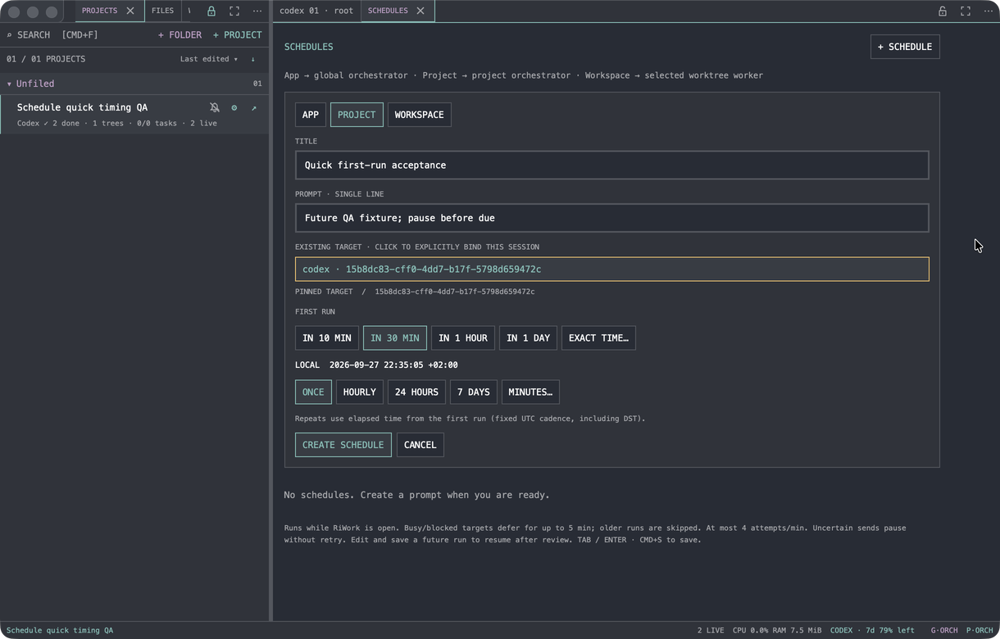
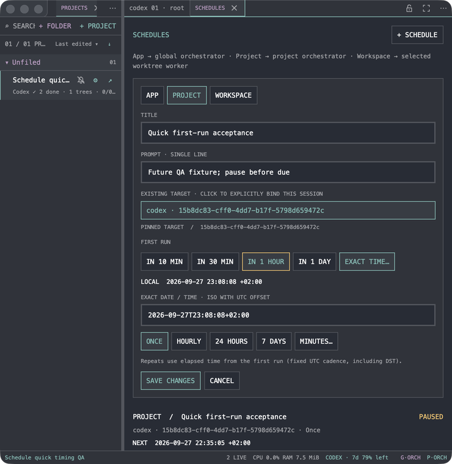

# Scheduling acceptance record

Verified on macOS, 2026-09-27, in `feature/desktop-schedules`. No production schedules or sessions were used. The inherited parent `RIWORK_HOME` remained `/Users/dominik/.local/share/riwork`; commands ran in fresh child homes. Native artifacts used this worktree's APFS-cloned Cargo target, never the root worktree's target. Zig: `0.16.0` from the requested executable.

## Checks

- `cargo build --offline`, with the requested Zig directory at the front of the child command's PATH: native build passed.
- `scripts/check-schedules.sh schedules`: 17 passed, two opt-in/helper tests excluded. The concurrent-process parent explicitly launches its excluded child helper with a fresh fixture home.
- `scripts/check-schedules.sh scheduling_readiness`: 2 passed. Completed-history text does not veto either known composer; current controls and drafts refuse input.
- `scripts/check-schedules.sh schedule_panel`: 2 passed. Covers custom-zero rejection and quick first-run selection without changing other editor fields.
- `scripts/check-schedules.sh`: 227 passed, two excluded. Tests run serially in a fresh child `RIWORK_HOME` and `RIWORK_RUNTIME_DIR`.
- `cargo fmt --check` and `git diff --check`: passed.
- Live Codex acceptance: the exact opt-in test below passed, 1/1, using three new disposable sessions and the existing account configuration. Each received one scheduled prompt, returned its exact marker, completed a fresh turn, and retained its pane/process identity. A later tick did not send again.

The live fixture project was `eb22a2ef-6e5c-44d4-81ea-238a0763fbc3`; workspace/worktree `64948b03-8ff7-4fef-98f9-1fd7e4433c35` represented this checkout in the disposable registry.

| Scope | Full disposable shell UUID | Provider reply |
| --- | --- | --- |
| App / global orchestrator | `ef7e58e2-c7d1-49e3-b1f5-eda2584fc6c0` | `SCHEDULE_DISPATCH_SCOPE_0` |
| Project / project orchestrator | `96bc8fed-873b-46d2-aa04-584b3479ef07` | `SCHEDULE_DISPATCH_SCOPE_1` |
| Workspace / explicitly selected worker | `13d218f0-af24-40ed-8dc5-f23e88c58bae` | `SCHEDULE_DISPATCH_SCOPE_2` |

The executed child command was:

```sh
RIWORK_HOME="$fixture_home" \
RIWORK_SCHEDULE_LIVE_HOME="$fixture_home" \
RIWORK_SCHEDULE_LIVE_IDS="ef7e58e2-c7d1-49e3-b1f5-eda2584fc6c0,96bc8fed-873b-46d2-aa04-584b3479ef07,13d218f0-af24-40ed-8dc5-f23e88c58bae" \
cargo test --offline -- --exact schedules::tests::isolated_live_provider_acceptance --ignored --test-threads=1 --nocapture
```

The fixture used injected due times `1000`, `1001`, and `1002` (hence the 1970 timestamps in screenshots) while delivery went to real Codex 0.157.1 processes. No provider tools ran. Temporary registry/home/app bundle and all three shells were removed afterward; only the new provider transcripts and sanitized screenshots remain.

## Native desktop verification

The iOS worker `bd609639-9b49-4970-a54b-fe0e5fc66b9c` was read first and left alone while active. Its final completion and idle prompt were confirmed before desktop interaction. Only RiWork Cua Driver MCP was used, under `riwork-desktop-schedules`; only that named session was explicitly ended. The driver's launch tool uses its transport session, which had to be revived after earlier teardown. No other named controller was ended.

A separate `dev.riwork.schedules.qa` bundle launched with a disposable `RIWORK_HOME` and runtime registry. Verified the scheduling shortcut, Tab/Return target selection, native title/prompt text input, Cmd+S creation, next run, pause, edit to custom five-minute recurrence, retained paused state and identity, and two-click deletion. Model readback confirmed each mutation, then the GUI window's closure was verified independently.

Window geometry was set and independently read back at 1220 × 780 and 740 × 760 points. Screenshots show the panel's compact styling, wrapping labels, and usable narrow editor. GPUI's custom body lacks native AX controls; screenshot-grounded foreground input was needed after background/off-Space delivery refusals. Text focus was verified in a separate click before typing. No alternate desktop provider was used.


## Focused acceptance corrections

Final correction logs are `/tmp/riwork-schedules-corrections-{focused,readiness,panel,full,build}.log`. Completed replies containing login/thinking/approve and quoted blocking messages were accepted through real disposable tmux dispatch, including the dimmed Codex composer. Busy lifecycle, live interrupt footer, trust/login/approval dialogs, draft input and a typed placeholder lookalike received no input. Existing binding, serialized input, custom notification hooks and bounded prompt-startup wait were retained.

The scheduler-level large-rollout fixture exceeds two `MAX_POLL_BYTES` budgets. Tracked ticks at `1000` and `1015` defer without input; tick `1030` catches up and submits once to the same pinned worker/provider. Later ticks do not duplicate delivery. The retained tracker emits no startup-history completion and no notification ledger is created.

Only Cua Driver inspected the revised native controls in the disposable `dev.riwork.schedules.acceptance` bundle, under `riwork-schedules-acceptance`. The specified iOS worker's final completion/idle prompt was rechecked before interaction. Background/transient shortcut delivery did not land in this run; the driver's native menu action opened Schedules, and screenshot-grounded foreground controls succeeded. No other desktop provider or user session was operated.

QA project `40a804d7-0352-4a96-ac58-d7a7a951b834`, workspace `84c6502e-aabe-4caa-9890-787f5806416e`, and three deterministic fixture shells were isolated in a new child home. Native creation using **IN 30 MIN** saved schedule `db13e756-edd8-41c3-b042-84b6394cab2c` at `2026-09-27T22:35:05+02:00` (`1790541305`). It was paused before due. An **IN 1 HOUR** edit saved `2026-09-27T23:08:08+02:00` (`1790543288`), revision 3, with its complete target identity and paused state unchanged. Last run remained empty.

1220 × 780 and 740 × 760 window geometry was independently read back. Quick choices, local offset preview and optional exact entry remained usable. The GUI exited through the driver's native Quit action; zero windows were confirmed. Only fixture shells `5aa8ecbe-c5f4-4368-b657-1235cab05aae`, `15b8dc83-cff0-4dd7-b17f-5798d659472c`, and `c9d6c220-c4af-4975-b421-bc7e10ec5504` were closed. Their child home and QA bundle were removed, and only the named correction driver session was explicitly ended. Inherited `RIWORK_HOME` remained unchanged. Earlier live all-scope Codex evidence above was preserved; authenticated provider acceptance was not repeated for these corrections.





## Review findings and limits

A preserved custom Codex notify hook initially left the new pane without an activity binding. The verified direct-PID rollout fallback now establishes exact identity without replacing that hook or guessing from a CWD. The dim default Codex placeholder also required explicit recognition; typed lookalikes and other unknown composer shapes fail closed.

A deterministic fixture initially advertised completion before its Python terminal had finished starting. The safe blank-screen refusal exposed that test race. Fixtures now wait for their own prompt with a bounded poll before dispatch assertions. The final full run passed.

Final review added regression checks for custom zero-minute input and for a completed replacement provider thread. Custom intervals cannot silently become one-time schedules; readiness tokens must belong to the pinned provider, and the provider identity is checked again inside the serialized input gate before claiming delivery.

Live provider acceptance covered Codex. Claude was verified with real isolated tmux input and structured UserPromptSubmit/Stop fixtures, including no delivery before completion; an authenticated live Claude account was not invoked. Unknown lifecycle/prompt variants and indirect/shared-server configurations without exact binding remain deferred or unavailable. Recurrence is elapsed UTC time; there is no calendar cron, closed-app launch daemon, or automatic retry after uncertain input. Submitted denotes terminal submission, not completed agent work. External manual input can race after a readiness sample.
